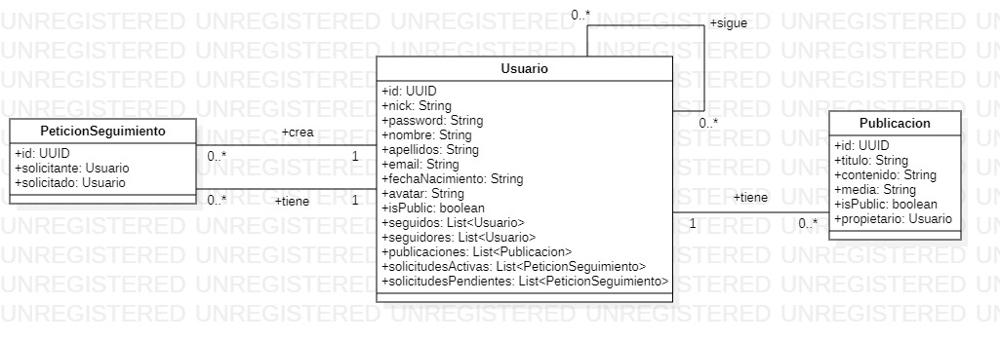

# MiarmaApp


Repositorio para la aplicación de "Miarma"

## Introducción

Se trata de una aplicación que simula una red social, en la que existen usuarios que pueden registrarse, publicar posts con fotos y vídeos y seguirse mutuamente para poder ver las publicaciones de otros usuarios.

Está implementada con Java y Spring en el backend y Flutter en el frontend.

***

_*PRÓXIMAMENTE*_
* Implementación de likes
* Implementación de comentarios en posts
* Implementación de subida de ficheros en la nube
* Despliegue de la app con Heroku

***

## Modelo de datos

El modelo seguido para realizar este proyecto ha sido el siguiente:




## Puesta en funcionamiento

Debemos ejecutar el backend y el frontend de la app por separado. Para ello, se pueden seguir los siguientes pasos:

* ### Backend: 


    Utilizando el terminal, escribir el siguiente comando (debemos asegurarnos que nos encontramos en la ruta del proyecto):

    ```cmd
    mvn spring-boot:run
    ```

    Si se dispone del IDE adecuado, también se podría ejecutar directamente desde el mismo.

* ### Frontend:

    _*EN PROCESO*_

Para poder probar la API correctamente sin necesidad de UI, se adjunta una colección Postman lista para probar todos los endpoints. Para ello, se deben seguir las siguientes recomendaciones:


* Para el endpoint "Nuevo usuario", se dispone de dos JSON de prueba, los cuales se encuentran en **src/main/java/resources/json/**, además de dos avatares de prueba para adjuntar a la petición, los cuales se encuentran en **src/main/java/resources/assets/**
* Para los endpoints "Nueva publicación con imagen" y "Nueva publicación con vídeo", también hay disponibles JSON, imágenes y vídeos de prueba en las mismas rutas descritas anteriormente.
* Lo mismo ocurre con el endpoint "Editar publicación" y "Editar perfil usuario".
* **IMPORTANTE**: Aunque los archivos ya aparezcan como adjuntos en Postman, se deberán de eliminar y volver a adjuntar la primera vez que se prueben, ya que, a pesar de encontrarse siempre en la misma ruta, Postman no los detecta al cambiar de un dispositivo a otro.
* En los endpoints en los que se requiera añadir un parámetro a la ruta, habrá que escoger el que nos interese en ese momento según lo que se quiera probar.
* En aquellos endpoints en los que se requiera un token, no será necesario aportarlo manualmente, ya que la colección de Postman ya lleva integrado un script que capta el token en el endpoint "Login usuario", y se encuentra insertado como variable en aquellos endpoints que así lo requieren.